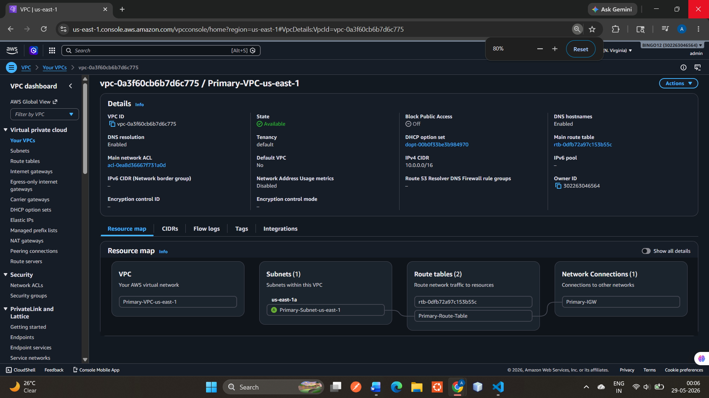
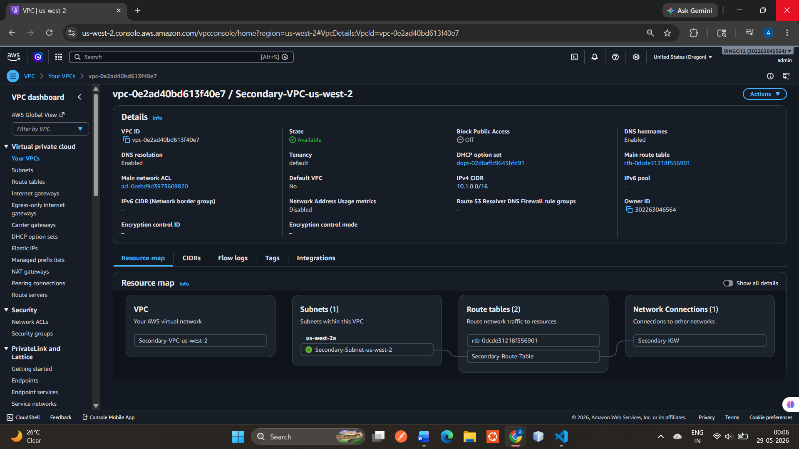
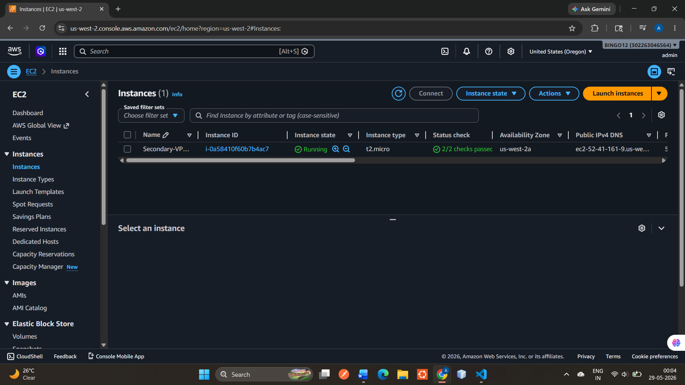
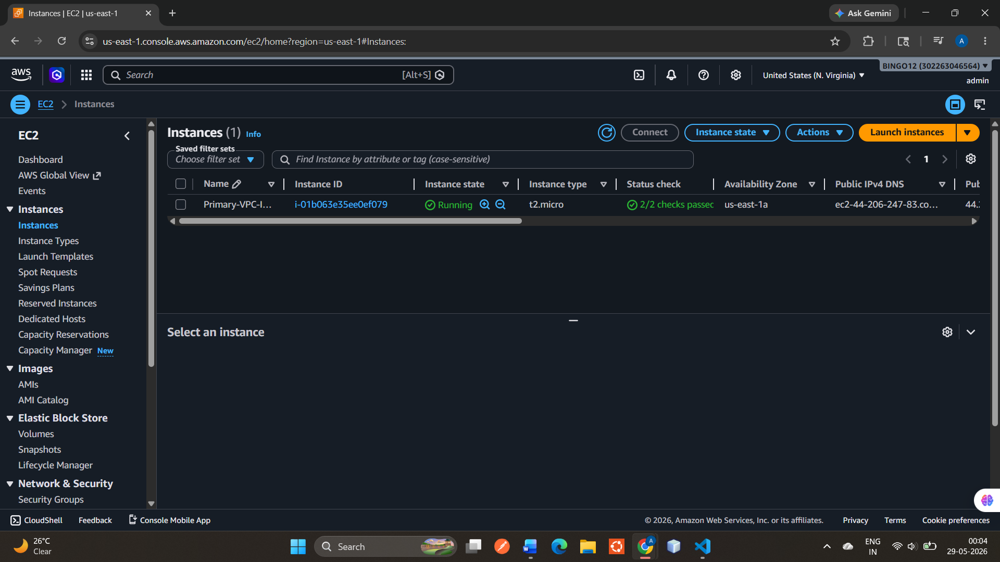

# AWS VPC Peering Project using Terraform

## Overview

This project demonstrates how to provision AWS infrastructure using Terraform and establish communication between two VPCs using VPC Peering.

The goal of this project was to gain hands-on experience with:

* Infrastructure as Code (IaC)
* AWS Networking
* Terraform Workflows
* VPC Peering Communication
* Remote Backend Configuration

---

# Architecture

```text
┌─────────────────────────────────────┐       ┌─────────────────────────────────────┐
│      Primary VPC (us-east-1)        │       │     Secondary VPC (us-west-2)      │
│      CIDR: 10.0.0.0/16              │       │      CIDR: 10.1.0.0/16             │
│                                     │       │                                     │
│  ┌───────────────────────────────┐  │       │  ┌───────────────────────────────┐  │
│  │      Public Subnet            │  │       │  │      Public Subnet            │  │
│  │      10.0.1.0/24              │  │       │  │      10.1.1.0/24              │  │
│  │                               │  │       │  │                               │  │
│  │   ┌───────────────────────┐   │  │       │  │   ┌───────────────────────┐   │  │
│  │   │     EC2 Instance      │   │  │       │  │   │     EC2 Instance      │   │  │
│  │   │   Private IP:         │   │  │       │  │   │   Private IP:         │   │  │
│  │   │     10.0.1.x          │   │  │       │  │   │     10.1.1.x          │   │  │
│  │   └───────────────────────┘   │  │       │  │   └───────────────────────┘   │  │
│  └───────────────────────────────┘  │       │  └───────────────────────────────┘  │
│                                     │       │                                     │
│        Internet Gateway             │       │        Internet Gateway             │
└─────────────────┬───────────────────┘       └─────────────────┬───────────────────┘
                  │                                             │
                  └────────────── VPC Peering ──────────────────┘
```


## Screenshots

#VPCs
> Add your VPC architecture screenshot here




---

## EC2 Instances

> Add your EC2 instances screenshot here




---

## VPC Peering Connection

> Add your VPC Peering screenshot here


---

# Technologies Used

* Terraform
* AWS
* VPC Peering
* EC2
* Route Tables
* Security Groups
* S3 Backend

---

# Infrastructure Created

This project provisions:

* Two AWS VPCs
* Public Subnets
* Route Tables
* Internet Gateways
* Security Groups
* EC2 Instances
* VPC Peering Connection
* Terraform Remote Backend using S3

---

# Key Learning Outcomes

Through this project, I learned:

* Infrastructure as Code (IaC) using Terraform
* Difference between Resources and Data Sources
* Difference between `aws_subnet` and `aws_subnets`
* Terraform state management
* Remote backend configuration using S3
* AWS VPC networking basics
* VPC Peering configuration
* Debugging Terraform configuration errors
* Managing Terraform workflows with Git and GitHub

---

# Project Structure

```bash
.
├── main.tf
├── variables.tf
├── terraform.tfvars
├── outputs.tf
├── provider.tf
├── data.tf
├── backend.tf
├── .gitignore
└── README.md
```

---

# Terraform Commands Used

## Initialize Terraform

```bash
terraform init
```

## Validate Configuration

```bash
terraform validate
```

## Preview Infrastructure Changes

```bash
terraform plan
```

## Apply Infrastructure

```bash
terraform apply
```

## Destroy Infrastructure

```bash
terraform destroy
```

---

---

# Important Notes

* `.terraform/` directory is excluded using `.gitignore`
* `terraform.tfstate` files are not pushed to GitHub
* Sensitive variables should not be committed publicly

---

# Future Improvements

* Add NAT Gateway
* Add Private Subnets
* Implement Auto Scaling
* Add Load Balancer
* Use Terraform Modules
* Add CI/CD Pipeline

---

# Author

Anjali Prasad

Learning DevOps | Cloud Computing | Terraform | AWS
